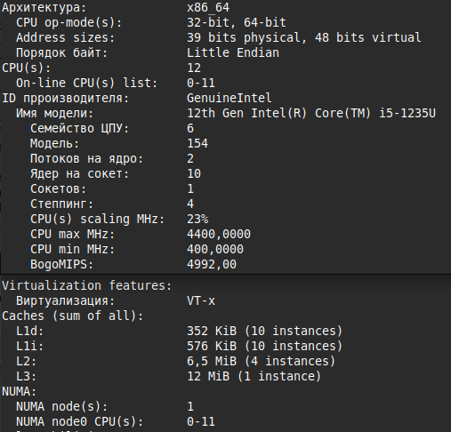
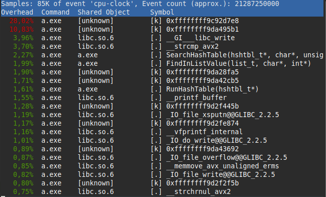
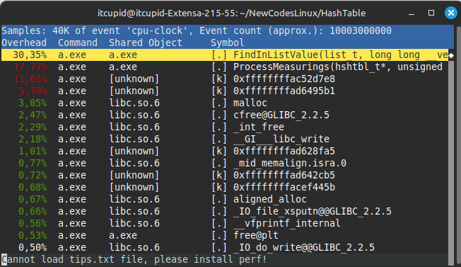
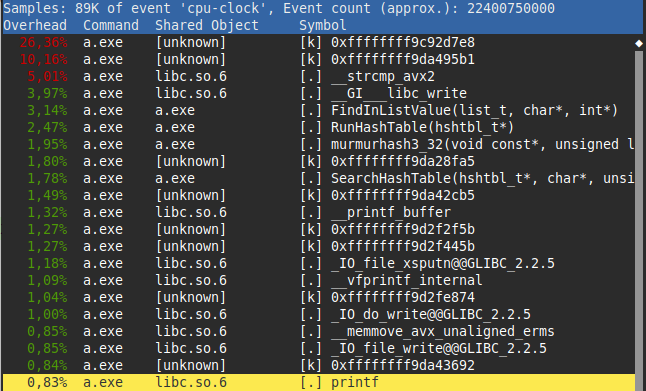
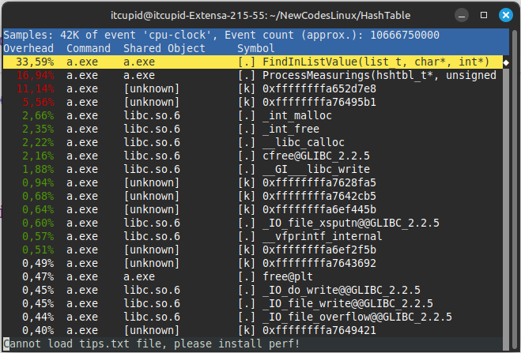
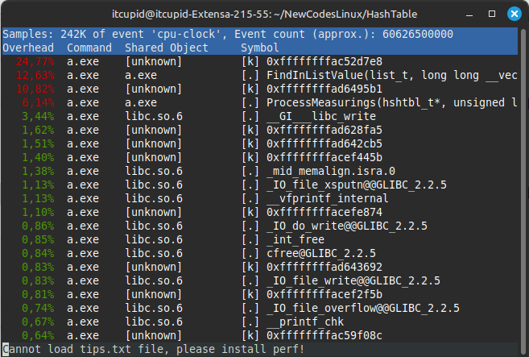

# Работа 3.3.4. Решение задачи быстрого поиска количества вхождений слова в большой текст на английском языке при помощи алгоритма хэш-таблицы и оптимизации времени поиска
## Содержание
- [0. АННОТАЦИЯ](#аннотация)
- [1. ВВЕДЕНИЕ](#введение)
- [2. МЕТОДИКА](#методика)
- [3. РЕЗУЛЬТАТЫ И ИХ ОБСУЖДЕНИЕ](#результаты-и-их-обсуждение)
- [4. ВЫВОДЫ](#выводы)
- [5. ПРИЛОЖЕНИЯ](#приложения)

## Аннотация
Для решения задачи быстрого поиска количества вхождений слова в большой текст на английском языке я выбрал алгоритм хэш-таблицы с методом разрешения коллизий методом цепочек. В первой версии хэш таблицы поиск 500 000 слов в хэш-таблице, состоящей из ≈ 20 000 уникальных слов занял (19.62 ± 0.21) с. С ключом оптимизации -O3 время поиска составило (14.36 ± 0.14) с. 

Затем я переписал стандартную функцию strcmp, используя интринсики, поместив слова в 256-битные целочисленные векторы с типом данных С++ __m256i. В итоге на поиск 500 000 слов в хэш-таблице, состоящей из ≈ 20 000 уникальных слов, стало уходить в среднем (10.96 ± 0.15) с. В результате этой оптимизации я добился ускорения работы программы на 31.0 % по сравнению с первой версией с ключом оптимизации -O3, поэтому сделал вывод, что оптимизация была оправдана.

## Введение
В таких направлениях, как журналистика, реклама и СМИ, часто появляется необходимость решения задачи быстрого поиска количества вхождений слова в большой текст.

Первым способом решения этой задачи является линейный перебор всех слов в тексте. Он имеет простую реализацию и подходит для достаточно маленьких текстов, таких как одиночный поисковой запрос в браузере. Однако поиск количества вхождений слова в текст большего размера таким методом будет занимать огромное время, так как будет происходить сравнение слова со всеми словами в тексте. Линейный перебор можно оптимизировать, например, с использованием интринсиков и при помощи развёртки цикла, однако время сравнения слова с каждым из, например, 100000 слов, всё равно займёт колоссальное время, которое будет увеличиваться при увеличении размера текста. Исходя из этого можно сделать вывод, что метод линейного перебора всех слов в тексте, хоть и является простым для реализации, не подходит для быстрого поиска количества вхождений слова в текст.

Более оптимальным решением является использование алгоритма хэш-таблицы. Этот метод подразумевает разделение всех слов в тесте на корзины в зависимости от значения их хэша. Существует два основных вида хеш-таблиц: с цепочками и открытой адресацией, которые отличаются методом разрешения коллизий - совпадений хэша разных слов. Я использовал вид хэш-таблицы с разрешением коллизий методом цепочек. Каждая ячейка хэш-таблицы этого типа содержит указатель на начало списка всех элементов, хеш которых равен номеру ячейки, либо указывает на их отсутствие. Коллизии приводят к тому, что появляются списки размером больше одного элемента. Для хэш-таблиц применяется такая характеристика, как load-фактор, которая показывает сколько в среднем слов приходится на одну корзину. В хороших хэш-таблицах load-фактор находится в диапазоне от 1.5 до 2. Это говорит о том, что линейный поиск по корзине может занимать в тысячи раз меньше времени, чем по всему тексту в целом, поэтому поиск количества вхождений слова в большой текст при помощи хэш-таблицы происходит гораздо быстрее, чем линейный перебор большого текста. К тому же время поиска с использованием алгоритма хэш-таблицы не зависит от размера текста, так как количество слов в корзине регулируется при помощи увеличения или уменьшения количества корзин, а время рассчёта хэша слова, очевидно, не зависит от размера текста.

 
  
 Рис. 1. Схема разрешения коллизий методом цепочек.
 

## Методика

Для решения задачи поиска количества вхождений слова в большой текст я выбрал алгоритм хэш-таблицы. Хорошая хэш-таблица имеет load-фактор равный 1.5-2. В работе использовалась хэш-таблица с load-фактором в десятикратном размере по сравнению с оптимальным, чтобы получить больше возможностей выстроить ассемблерные оптимизации. 

Ассемблерные оптимизации относятся к аппаратно-зависимым, поэтому могут давать разные результаты на отличающихся машинах. На рис. 1 приведены характеристики моего процессора, для которого проводились оптимизации и измерения. 

 
  
 Рис. 2. Характеристики процессора, для которого проводились оптимизации и измерения, полученные при помощи команды 'lscpu' в терминале Linux Mint.
 

Для проведения измерений времени использовалась функция clock_t clock () из библиотеки time.h, которая выдавала общее количество процессорного времени, прошедшего с момента начала выполнения программы. Чтобы уменьшить влияние таких факторов, как разрешение системного таймера и наличие системных прерываний при выполнении программы, проводилось 20 измерений для каждой версии программы, а результат округлялся с учётом случайной погрешности.

В качестве хэш-функции использовалась упрощённая версия MurmurHash2 - murmurhash3. При выборе хэш-функции использовались такие факторы, как скорость, хорошее распределение и простота реализации. Путём увеличения количества корзин достигалось распределение по 14-19 слов на корзину. 

Для тестирования производительности в хэш таблицу загружался текст произведения "Война и мир" Л. Н. Толстого (≈ 20 000 уникальных слов) и проводился поиск ≈ 500 000 слов, полученных из книги Джейн Остин "Гордость и предубеждение". Слова располагались по одному на каждую строку. Числа отфильтровывались. Во время работы программы на экран выводилось сообщение, если слово не нашлось в хэш-таблице, и ничего не выводилось иначе. Для расчёта количества вхождений можно настроить программу на добавление слов в хэш-таблицу в виде структур, одним полем которых будет ключ (слово), а вторым счётчик вхождений, который будет обновляться каждый раз, когда слово будет найдено в тексте.

## Результаты и их обсуждение

### Первая версия
В первой версии хэш таблицы (см. Приложение А) поиск 500 000 слов в хэш-таблице, состоящей из ≈ 20 000 уникальных слов, выполнялся в среднем за (19.62 ± 0.21) с. С ключом оптимизации -O3 время поиска составило (14.36 ± 0.14) с (см. Приложение В). Таким образом, прирост производительности первой версии за счёт оптимизации при помощи ключа -O3 составил 36.6 %.

### Вторая версия
Чтобы узнать, как можно ускорить поиск слова, я создал профили программы при помощи инструмента Perf (см. рис. 2). По нему я определил, что наибольшее время уходит на сравнение слов функцией strcmp.

 
  
 Рис. 3. Фрагмент профиля, полученного инстументом perf, первой версии программы для быстрого поиска количества вхождений слова в текст с ключом оптимизации -O3.
 

Я заметил, что практически все английские слова имеют длину меньше 32 букв и решил использовать эту особенность входных данных для оптимизации. Если будет необходимо провести поиск количества вхождений слов, имеющих длину больше 32 букв, программу можно дополнить обработчиком слов большей длины, который будет использовать стандартный метод. Однако его реализация не входит в мой проект, так как версия с поддержкой слов длины до 32 букв перекрывает большую часть потребностей в данной программе.

В качестве оптимизации я переписал стандартную функцию strcmp, используя интринсики, поместив слова в 256-битные целочисленные векторы с типом данных С++ __m256i. Таким образом, во второй версии программы с моей inline функцией MyStrcmp с интринсиками вместо стандартной функции strcmp на поиск 500 000 слов в хэш-таблице, состоящей из ≈ 20 000 уникальных слов, тратилось в среднем (10.96 ± 0.15) с (см. Приложение В). По итогам этой оптимизации я добился ускорения работы программы на 31.0 % по сравнению с первой версией с ключом оптимизации -O3 и на 79.0 % по сравнению с первой версией программы без ключей оптимизации. Оптимизация с использованием интринсиков обоснована, так как она сократила время выполнения программы на четверть.

Для дальнейшей оптимизации при помощи ассемблерных вставок и переписывания функции на языке ассемблера удобно было переписать вторую версию программы на хранение слов в формате __m128i. В результате этого действия я получил ускорение по сравнению с версией, в которой слова хранились в формате char* (см. Приложение А). Однако максимальная длина слова сократилась до 16 букв. Это ограничение плохо сказывается на области применимости программы, поэтому для лучшего функционирования нужна функция, обрабатывающая исключительные случаи (слова с длиной больше 16 символов). В связи с ограниченностью времени на написание программы я опустил этот момент. В этой версии для слов с длиной больше 16 букв проводится сравнение первых 16 символов. По итогу во второй версии время поиска 500 000 слов в хэш-таблице, состоящей из ≈ 20 000 уникальных слов, в среднем составило (9.99 ±0.03) с.

### Третья версия

 
  
 Рис. 4. Фрагмент профиля, полученного инстументом perf, второй версии программы для быстрого поиска количества вхождений слова в текст с ключом оптимизации -O3. После переписывания на хранение слов в формате __m128i.
 

## Выводы
Оптимизация с использованием моей функции MyStrcmp, работающей со словами, помещёнными в 256-битные целочисленные векторы с типом данных С++ __m256i, при помощи интринсиков, позволила уменьшить время выполнения программы на 31% при этом код не потерял своей читаемости за исключением функции MyStrcmp. Для решения этой проблемы можно написать документацию для этой функции. На основе этого я сделал вывод, что оптимизация интринсиками оказалась оправдана.

## Приложения
### Приложение А. Ход работы

  Написав первую работающую версию хэш-таблицы я столкнулся с проблемой. Она заключалась в том, что по профилю, полученному с помощью perf и valgrind, на выполнение функции strlen уходило 96% времени. Я подумал, что дело в стандартной реализации strlen, поэтому написал свою реализацию strlen на ассемблере NASM, которая сравнивала слова длины <= 32 символа. Однако после этого я увидел, что скорость почти не увеличилась, и на выполнение strlen всё равно уходила большая часть времени. Оказалось, что функция strlen вызывалась не только в моих функциях. В большинстве случаев она вызывалась из стандартной функции sscanf (const char *str, const char *format, ...). Тогда я исправил свою реализацию хэш-таблицы так, чтобы она не содержала вызовов sscanf, на которые уходила большая часть времени, заменив их на ручную обработку входящего текста, и получил первую версию своей реализации хэш таблицы для быстрого поиска количества вхождений слова в большой текст.

  В первой версии хэш таблицы поиск 500 000 слов в хэш-таблице, состоящей из ≈ 20 000 уникальных слов, выполнялся в среднем за (19.62 ± 0.21) с. С ключом оптимизации -O3 время поиска составило (14.36 ± 0.14) с. Прирост производительности первой версии с ключом оптимизации -O3 составил 36.6 %. 

По профилю программы, полученному при помощи инструментов Perf и Valgrind, я определил, что наибольшее время уходит на сравнение слов функцией strcmp. Я заметил, что практически все английские слова имеют длину меньше 32 букв, поэтому решил переписать функцию strcmp, используя интринсики, поместив слова в 256-битные целочисленные векторы с типом данных С++ __m256i. Таким образом, во второй версии программы с моей inline функцией MyStrcmp с интринсиками вместо стандартной функции strcmp и с ключом оптимизации -O3 на поиск 500 000 слов в хэш-таблице, состоящей из ≈ 20 000 уникальных слов, тратилось в среднем (10.96 ± 0.15) с. В результате этой оптимизации я добился ускорения работы программы на 31.0 % по сравнению с первой версией с ключом оптимизации -O3 и на 79.0 % по сравнению с первой версией программы без ключей оптимизации. Таким образом, оптимизация с использованием интринсиков обоснована, так как она сократила время выполнения программы на четверть.

  После того как я переписал вторую версию программы на хранение слов в формате __m256i поиск слов стал тратить в 3 раза больше времени (см. Приложение В). Возможно, это связано с тем, что списки стали хуже ложиться на кэш. При переписывании на хранение в формате __m128i программа ускорилась по сравнению со стандартной второй версией. Я сделал вывод, что при этом она стала лучше работать с кэшом. Время поиска 500 000 слов в хэш-таблице, состоящей из ≈ 20 000 уникальных слов, в среднем составило (9.99 ±0.03) с. 

### Приложение Б. Профили программы, полученные на этапе оптимизации

 
  
 Рис. 5. Фрагмент профиля, полученного инстументом perf, первой версии программы для быстрого поиска количества вхождений слова в текст без ключей оптимизации.
 

 
  
 Рис. 6. Фрагмент профиля, полученного инстументом perf, второй версии программы для быстрого поиска количества вхождений слова в текст с ключом оптимизации -O3.
 
  

 
  
 Рис. 7. Фрагмент профиля, полученного инстументом perf, второй версии программы для быстрого поиска количества вхождений слова в текст с ключом оптимизации -O3. После переписывания на хранение слов в формате __m256i.
 

### Приложение В. Результаты измерений 

| №  | Время, с    |
|----|-------------|
| 1  | 18.410650   |
| 2  | 18.805733   |
| 3  | 19.181007   |
| 4  | 19.302517   |
| 5  | 19.567022   |
| 6  | 19.502940   |
| 7  | 19.706420   |
| 8  | 19.645770   |
| 9  | 19.517391   |
| 10 | 19.854455   |
| 11 | 19.908282   |
| 12 | 19.865856   |
| 13 | 19.997433   |
| 14 | 19.918362   |
| 15 | 19.819202   |
| 16 | 19.828763   |
| 17 | 20.021246   |
| 18 | 19.842166   |
| 19 | 20.033711   |
| 20 | 19.759790   |

 Таблица 1. Время, потраченное на поиск 500 000 слов в хэш таблице, составленной по словам из 4 томов "Войны и мира" Л.Н. Толстого (≈ 20 000 уникальных слов), в первой версии без ключей оптимизации. Проведено 20 измерений.
 

| №  | Время, с    |
|----|-------------|
| 1  | 13.720123   |
| 2  | 13.917075   |
| 3  | 13.823811   |
| 4  | 14.050114   |
| 5  | 14.131037   |
| 6  | 14.374726   |
| 7  | 14.278763   |
| 8  | 14.247944   |
| 9  | 14.155008   |
| 10 | 14.367062   |
| 11 | 14.457153   |
| 12 | 14.661467   |
| 13 | 14.521086   |
| 14 | 14.459557   |
| 15 | 14.533962   |
| 16 | 14.591118   |
| 17 | 14.538102   |
| 18 | 14.655122   |
| 19 | 14.581954   |
| 20 | 14.755432   |

 Таблица 2. Время, потраченное на поиск 500 000 слов в хэш таблице, составленной по словам из 4 томов "Войны и мира" Л.Н. Толстого (≈ 20 000 уникальных слов), в первой версии с ключом оптимизации -О3. Проведено 20 измерений.
 

| №  | Время, с    |
|----|-------------|
| 1  | 10.571131   |
| 2  | 10.417830   |
| 3  | 10.474015   |
| 4  | 10.586726   |
| 5  | 10.722092   |
| 6  | 10.763359   |
| 7  | 10.829081   |
| 8  | 10.958345   |
| 9  | 10.973237   |
| 10 | 10.888314   |
| 11 | 10.992591   |
| 12 | 11.019356   |
| 13 | 11.030353   |
| 14 | 11.376495   |
| 15 | 11.149657   |
| 16 | 11.453312   |
| 17 | 11.205521   |
| 18 | 11.382344   |
| 19 | 11.233946   |
| 20 | 11.403600   |

 Таблица 3. Время, потраченное на поиск 500 000 слов в хэш таблице, составленной по словам из 4 томов "Войны и мира" Л.Н. Толстого (≈ 20 000 уникальных слов) во второй версии программы с ключом оптимизации -О3 с использованием моей inline функции strcmp с интринсиками. Проведено 20 измерений.
 

| №   | Время, с  |
|-----|----------|
| 1   | 31.635706 |
| 2   | 31.065171 |
| 3   | 31.317830 |
| 4   | 31.414129 |
| 5   | 32.066407 |
| 6   | 32.024288 |
| 7   | 32.101352 |
| 8   | 31.821128 |
| 9   | 32.278812 |
| 10  | 32.534596 |
| 11  | 32.627325 |
| 12  | 32.537062 |
| 13  | 32.998807 |
| 14  | 32.724371 |
| 15  | 32.553768 |
| 16  | 32.893287 |
| 17  | 32.894445 |
| 18  | 32.641911 |
| 19  | 32.930370 |
| 20  | 32.886515 |

 Таблица 4. Время, потраченное на поиск 500 000 слов в хэш таблице, составленной по словам из 4 томов "Войны и мира" Л.Н. Толстого (≈ 20 000 уникальных слов) во второй версии, переписанной для хранения слов в формате __m256i. Время поиска увеличилось в 3 раза, возможно, это связано с тем, что списки стали хуже ложиться на кэш. Проведено 20 измерений.
 

| №  | Время, с  |
|----|-----------|
| 1  | 9.672286  |
| 2  | 9.775827  |
| 3  | 9.739618  |
| 4  | 9.807295  |
| 5  | 9.738250  |
| 6  | 9.839216  |
| 7  | 9.795908  |
| 8  | 9.959858  |
| 9  | 10.179992 |
| 10 | 9.887912  |
| 11 | 9.829669  |
| 12 | 10.034920 |
| 13 | 10.095802 |
| 14 | 9.981884  |
| 15 | 10.083067 |
| 16 | 9.978669  |
| 17 | 10.061643 |
| 18 | 10.224495 |
| 19 | 9.988044  |
| 20 | 10.066364 |

 Таблица 5. Время, потраченное на поиск 500 000 слов в хэш таблице, составленной по словам из 4 томов "Войны и мира" Л.Н. Толстого (≈ 20 000 уникальных слов) во второй версии, переписанной для хранения слов в формате __m128i. Время поиска уменьшилось по сравнению со стандартной второй версией, вероятно, программа стала лучше использовать кэш. Проведено 20 измерений.
 
