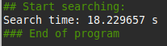
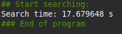
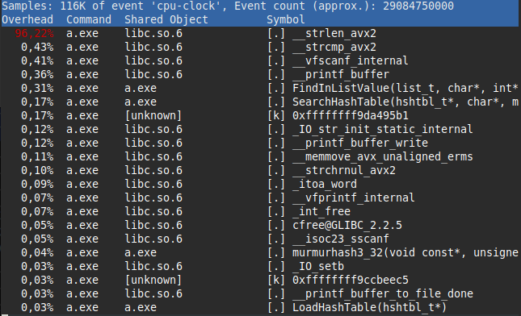
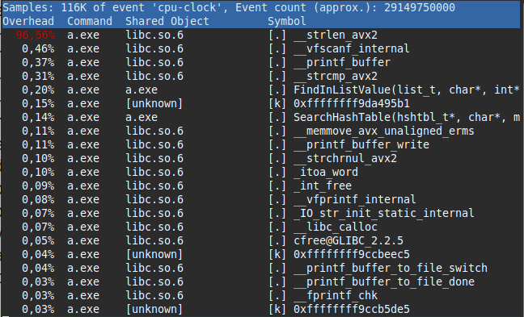

# Laboratory work 3.3.4. The task of fast finding the number of occurrences of a word in the text
## Contents
- [0. Annotation](#annotation)
- [1. Introduction](#introduction)
- [2. Methods](#methods)
- [3. Results](#results)
- [4. Conclusion](#conclusion)
- [5. Appendix](#appendix)

## Annotation
I solved this task used hash table. Finding spend xx s in the first version. With optimization keys this version spend 123 s. I checked profile of execution my program to find functions that spend many time. 

## Introduction
Task of finding

## Methods

## Results

 
  
 Fig. 1. First version without optimization keys
 

 
  
 Fig. 2. First version with -O3
 

 
  
 Fig. 3. Perf output first version without optimization keys
 

 
  
 Fig. 4. Perf output first version -O3
 

### Model

### Measurements

## Conclusion

## Appendix
