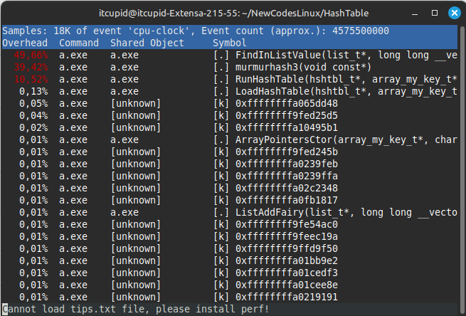
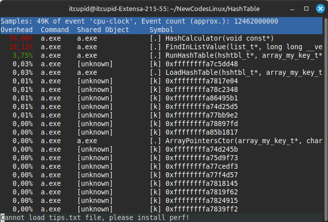
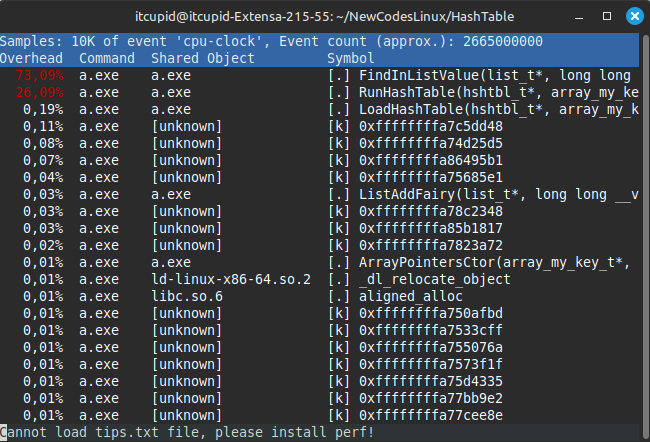

# Работа 3.3.4.<br>Решение задачи быстрого поиска количества вхождений слова в большой текст на английском языке при помощи хэш-таблицы и оптимизация времени поиска
## Содержание
- [0. АННОТАЦИЯ](#аннотация)
- [1. ВВЕДЕНИЕ](#введение)
- [2. МЕТОДИКА](#методика)
- [3. РЕЗУЛЬТАТЫ И ИХ ОБСУЖДЕНИЕ](#результаты-и-их-обсуждение)
- [4. ВЫВОДЫ](#выводы)
- [5. ПРИЛОЖЕНИЯ](#приложения)

## Аннотация
Для решения задачи быстрого поиска количества вхождений слова в большой текст на английском языке я выбрал хэш-таблицу с методом разрешения коллизий методом цепочек. В первой версии хэш таблицы поиск 75 ⋅ 10⁶ слов в хэш-таблице, состоящей из ≈ 20 000 уникальных слов занял (19.62 ± 0.21) с. С ключом оптимизации -O3 время поиска составило (14.36 ± 0.14) с. Прирост производительности первой версии за счёт оптимизации при помощи ключа -O3 составил 36.6 %. 

Затем я переписал стандартную функцию strcmp, используя интринсики, поместив слова в 256-битные целочисленные векторы с типом данных С++ __m256i. В итоге на поиск 75 ⋅ 10⁶ слов в хэш-таблице, состоящей из ≈ 20 000 уникальных слов, стало уходить в среднем (10.96 ± 0.15) с. В результате этой оптимизации я добился ускорения работы программы на 31.0 % по сравнению с первой версией с ключом оптимизации -O3, поэтому сделал вывод, что оптимизация была оправдана.

Далее наибольшее время стало уходить на функцию линейного поиска ключа в списке `FindInListValue`. Я попытался оптимизировать её, переписав целиком на NASM. Однако получил слишком маленькое ускорение (0.5 %), поэтому исключил это из итогового проекта. 

После профилирования я заметил, что на функцию расчёта хэша `murmurhash3` уходило значительное время. Я оптимизировал её при помощи встроенного ассемблера, однако она только замедлила программу. Для её ускорения необходимо было бы пожертвовать читаемостью основных функций `LoadHashTable` и `RunHashTable`, так как можно было провести развёртку цикла. К тому же из профиля, полученного инструментом perf, я определил, что компилятор с ключом оптимизации -O3 использует именно развёртку цикла для этой функции, следовательно моя оптимизация не дала бы большого ускорения. Исходя из этого я заменил функцию расчёта хэша на `HashCalculator`, чтобы показать, как можно ускорить программу при помощи ассемблерной вставки.

Оптимизация функции `HashCalculator` при помощи встроенного ассемблера уменьшила время поиска на 142 % по сравнению с версией с функцией `HashCalculator`, оптимизированной -O3, и на 28 % по сравнению с версией с функцией `murmurhash3`, оптимизированной -O3. 

## Введение
В таких направлениях, как журналистика, реклама и СМИ, часто появляется необходимость решения задачи быстрого поиска количества вхождений слова в большой текст.

Первым способом решения этой задачи является линейный перебор всех слов в тексте. Он имеет простую реализацию и подходит для достаточно маленьких текстов, таких как одиночный поисковой запрос в браузере. Однако поиск количества вхождений слова в текст большего размера таким методом будет занимать огромное время, так как будет происходить сравнение слова со всеми словами в тексте. Линейный перебор можно оптимизировать, например, с использованием интринсиков и при помощи развёртки цикла, однако время сравнения слова с каждым из, например, 100000 слов, всё равно займёт колоссальное время, которое будет увеличиваться при увеличении размера текста. Исходя из этого можно сделать вывод, что метод линейного перебора всех слов в тексте, хоть и является простым для реализации, не подходит для быстрого поиска количества вхождений слова в текст.

Более оптимальным решением является использование алгоритма хэш-таблицы. Этот метод подразумевает разделение всех слов в тесте на корзины в зависимости от значения их хэша. Существует два основных вида хеш-таблиц: с цепочками и открытой адресацией, которые отличаются методом разрешения коллизий - совпадений хэша разных слов. Я использовал вид хэш-таблицы с разрешением коллизий методом цепочек. Каждая ячейка хэш-таблицы этого типа содержит указатель на начало списка всех элементов, хеш которых равен номеру ячейки, либо указывает на их отсутствие. Коллизии приводят к тому, что появляются списки размером больше одного элемента (см. рис. 1). 

<div align="center"></div><br>
  <div align="center"> Рис. 1. Схема разрешения коллизий методом цепочек [1].</div><br>

Для хэш-таблиц применяется такая характеристика, как load-фактор, которая показывает сколько в среднем слов приходится на одну корзину. В хороших хэш-таблицах load-фактор находится в диапазоне от 1.5 до 2. Это говорит о том, что линейный поиск по корзине может занимать в тысячи раз меньше времени, чем по всему тексту в целом, поэтому поиск количества вхождений слова в большой текст при помощи хэш-таблицы происходит гораздо быстрее, чем линейный перебор большого текста. К тому же время поиска с использованием алгоритма хэш-таблицы не зависит от размера текста, так как количество слов в корзине регулируется при помощи увеличения или уменьшения количества корзин, а время рассчёта хэша слова, очевидно, не зависит от размера текста.

## Методика

Для решения задачи поиска количества вхождений слова в большой текст я выбрал алгоритм хэш-таблицы. Хорошая хэш-таблица имеет load-фактор равный 1.5-2. В работе использовалась хэш-таблица с load-фактором в десятикратном размере по сравнению с оптимальным, чтобы получить больше возможностей выстроить ассемблерные оптимизации. 

Ассемблерные оптимизации относятся к аппаратно-зависимым, поэтому могут давать разные результаты на отличающихся машинах. На рис. 1 приведены характеристики моего процессора, для которого проводились оптимизации и измерения. 

<div align="center"></div><br>
  <div align="center"> Рис. 2. Характеристики процессора, для которого проводились оптимизации и измерения, полученные при помощи команды 'lscpu' в терминале Linux Mint.</div><br>

Для проведения измерений времени использовалась функция `clock_t clock ()` из библиотеки `time.h`, которая выдавала общее количество процессорного времени, прошедшего с момента начала выполнения программы. Чтобы уменьшить влияние таких факторов, как разрешение системного таймера и наличие системных прерываний при выполнении программы, проводилось 20 измерений для каждой версии программы, а результат округлялся с учётом случайной погрешности.

В качестве хэш-функции использовалась упрощённая версия MurmurHash2 - murmurhash3. При выборе хэш-функции использовались такие факторы, как скорость, хорошее распределение и простота реализации. Путём увеличения количества корзин достигалось распределение по 14-19 слов на корзину. 

Для тестирования производительности в хэш таблицу загружался текст произведения "Война и мир" Л. Н. Толстого (≈ 20 000 уникальных слов) и проводился поиск ≈ 75 ⋅ 10⁶ слов, полученных из книги Джейн Остин "Гордость и предубеждение" (75 ⋅ 10⁶ слов искались путём запуска функции поиска 500 тысяч слов 150 раз). Слова располагались по одному на каждую строку. Числа отфильтровывались. Во время работы программы на экран выводилось сообщение, если слово не нашлось в хэш-таблице, и ничего не выводилось иначе. 

Для расчёта количества вхождений слова в текст можно настроить программу на добавление слов в хэш-таблицу в виде структур, одним полем которых будет ключ (слово), а вторым счётчик вхождений, который будет обновляться каждый раз, когда слово будет найдено в тексте. Однако в проекте оставлен вариант с загрузкой самого слова в хэш-таблицу, так как главной задачей было добиться максимальной скорости его поиска в хэш-таблице с load-фактором в десятикратном размере путём ассемблерных оптимизаций.

## Результаты и их обсуждение

### Первая версия

Написав первую работающую версию хэш-таблицы я столкнулся с проблемой. Она заключалась в том, что по профилю, полученному с помощью инструмента perf, на выполнение функции strlen уходило 96% времени (см. рис. 3). 

<div align="center"></div><br>
  <div align="center"> Рис. 3. Фрагмент профиля, полученного инстументом perf, начальной версии программы для быстрого поиска количества вхождений слова в текст без ключей оптимизации. На функцию strlen уходило 96 % времени.</div><br>

Затем я перекомпилировал и запустил программу с ключом оптимизации -O3 (см. рис. 4). По нему я определил, что мои функции ускорились, однако на функцию `strlen` продолжило уходить 96 % времени выполнения. 

<div align="center"></div><br>
  <div align="center"> Рис. 4. Фрагмент профиля, полученного инстументом perf, начальной версии программы для быстрого поиска количества вхождений слова в текст с ключом оптимизации -O3. На функцию strlen уходило 96 % времени несмотря на включение оптимизаций.</div><br>

Я подумал, что дело в стандартной реализации `strlen`, поэтому написал свою реализацию `strlen` на ассемблере NASM, которая сравнивала слова длины <= 32 символа. Однако после этого я увидел, что скорость почти не увеличилась, и на выполнение `strlen` всё равно уходила большая часть времени. Оказалось, что функция `strlen` вызывалась не только в моих функциях. В большинстве случаев она вызывалась из стандартной функции `sscanf (const char *str, const char *format, ...)`. Тогда я исправил свою реализацию хэш-таблицы так, чтобы она не содержала вызовов `sscanf`, на которые уходила большая часть времени, заменив их на ручную обработку входящего текста, и получил первую версию своей реализации хэш таблицы для быстрого поиска количества вхождений слова в большой текст.

Таким образом, в первой версии хэш таблицы поиск 75 ⋅ 10⁶ слов в хэш-таблице, состоящей из ≈ 20 000 уникальных слов, выполнялся в среднем за (19.62 ± 0.21) с (см. Приложение А).

<div align="center"></div><br>
  <div align="center"> Рис. 5. Фрагмент профиля, полученного инстументом perf, первой версии программы для быстрого поиска количества вхождений слова в текст без ключей оптимизации.</div><br>

С ключом оптимизации -O3 время поиска составило (14.36 ± 0.14) с (см. Приложение А). Таким образом, прирост производительности первой версии за счёт оптимизации при помощи ключа -O3 составил 36.6 % (см. рис. 6).

<div align="center"></div><br>
  <div align="center"> Рис. 6. Фрагмент профиля, полученного инстументом perf, первой версии программы для быстрого поиска количества вхождений слова в текст с ключом оптимизации -O3.</div><br>

### Вторая версия

Чтобы узнать, как можно ускорить поиск слова, я создал профиль программы при помощи инструмента Perf (см. рис. 2). По нему я определил, что наибольшее время уходит на сравнение слов функцией `int strcmp (const char *s1, const char *s2)`.

Я заметил, что практически все английские слова имеют длину меньше 32 букв и решил использовать эту особенность входных данных для оптимизации функции `strcmp`. Для ситуации, когда необходимо провести поиск количества вхождений слов, имеющих длину больше 32 букв, программу можно дополнить обработчиком слов большей длины, который будет использовать стандартный метод. Однако его реализация не входит в мой проект, так как версия с поддержкой слов длины до 32 букв перекрывает большую часть потребностей в данной программе.

Для оптимизации я переписал стандартную функцию `strcmp`, используя интринсики, поместив слова в 256-битные целочисленные векторы с типом данных С++ __m256i. Таким образом, во второй версии программы с моей inline функцией `MyStrcmp` с интринсиками вместо стандартной функции `strcmp` на поиск 75 ⋅ 10⁶ слов в хэш-таблице, состоящей из ≈ 20 000 уникальных слов, тратилось в среднем (10.96 ± 0.15) с (см. Приложение А). По итогам этой оптимизации я добился ускорения работы программы на 31.0 % по сравнению с первой версией с ключом оптимизации -O3 и на 79.0 % по сравнению с первой версией программы без ключей оптимизации. Оптимизация с использованием интринсиков обоснована, так как она сократила время выполнения программы на четверть, при этом код не потерял своей читаемости за исключением функции `MyStrcmp`. Чтобы решить эту проблему, можно написать документацию для этой функции. Поэтому я сделал вывод, что оптимизация интринсиками оказалась оправдана. Код моей функции `MyStrcmp` приведён в следующем блоке кода.

```C++
inline uint32_t MyStrcmp (my_key_t first_string, my_key_t second_string)
{
    __m128i result_of_compare = _mm_cmpeq_epi32   (*first_string, *second_string);

    uint32_t mask             = (uint32_t) _mm_movemask_epi8 (result_of_compare);

    return mask;
}
```

<div align="center"></div><br>
  <div align="center"> Рис. 7. Фрагмент профиля, полученного инстументом perf, второй версии программы для быстрого поиска количества вхождений слова в текст с ключом оптимизации -O3 после написания моей inline функции MyStrcmp с использованием интринсиков.</div><br>

Для дальнейшей оптимизации при помощи ассемблерных вставок и переписывания функции на языке ассемблера удобно было переписать вторую версию программы на хранение слов в формате __m256i. После этого действия поиск слов стал тратить в 3 раза больше времени (см. Приложение А). Возможно, это связано с тем, что списки стали хуже ложиться на кэш, то есть стали чаще проявляться промахи кэша. 
  
<div align="center"></div><br>
  <div align="center"> Рис. 8. Фрагмент профиля, полученного инстументом perf, второй версии программы для быстрого поиска количества вхождений слова в текст с ключом оптимизации -O3. После переписывания на хранение слов в формате __m256i. С моей inline функцией `MyStrcmp` с использованием интринсиков.</div><br>

Тогда я решил использовать формат __m128i для хранения слов и получил ускорение по сравнению с версией, в которой слова хранились в формате char* (см. Приложение А), однако максимальная длина слова сократилась до 16 букв. Это ограничение плохо сказывается на области применимости программы. Программа всё ещё покрывает большинство ситуаций, однако для лучшего функционирования нужна функция, обрабатывающая исключительные случаи (слова с длиной больше 16 символов). В связи с ограниченностью времени на написание программы я опустил этот момент. В этой версии для слов с длиной больше 16 букв проводится сравнение первых 16 символов. По итогу во второй версии время поиска 75 ⋅ 10⁶ слов в хэш-таблице, состоящей из ≈ 20 000 уникальных слов, в среднем составило (9.99 ±0.03) с, то есть программа ускорилась ещё на 10 %.

<div align="center"></div><br>
  <div align="center"> Рис. 9. Фрагмент профиля, полученного инстументом perf, второй версии программы для быстрого поиска количества вхождений слова в текст с моей inline функцией MyStrcmp с использованием интринсиков с ключом оптимизации -O3 после переписывания на хранение слов в формате __m128i.</div><br>

### Третья версия

Далее я решил провести рефакторинг своей программы, чтобы вынести подготовку входных данных из процесса поиска слов. На предыдущем этапе память выделялась под каждый ключ непосредственно перед его поиском. Было принято решение заранее создать массив из слов в формате __m128i и массив указателей на слова для передачи его в функцию загрузки и функцию поиска.

Для того, чтобы сделать проще процесс создания таких массивов, я изменил формат входных данных с текстового файла, в котором в каждой строке находится по одному слову, на бинарный, в котором вподряд записаны все слова, и каждое слово занимает ровно 16 байт. То есть в новой версии слова, имеющие длину меньше 16 символов, дополнялись символами '\0' до 16 байт, а слова, имеющие длину больше 16 символов, обрезались (длина слова рассчитывается с учётом терминального символа '\0'). Такой формат входных данных позволил создать массив указателей простым циклом с одним действием внутри (см. HashTable/InputData.cpp и HashTable/InputData.h):

```C
size_t index_pointer = 0;

for (size_t i = 0; i < array_pointers->size_file; i += MAX_SIZE_WORD)
{
  assert (i < array_pointers->size_file);
  
  array_pointers->pointers[index_pointer] = (my_key_t*)(array_pointers->text + i);
          
  index_pointer++;
}
```

Перевод из текстового файла с распределением по одному слову на каждую строку в бинарный файл, описанный выше, можно реализовать простым кодом на языке Python:

```Python
def text_to_binary(input_file, output_file):
    with open(input_file, 'r', encoding='utf-8') as txt_file, \
         open(output_file, 'wb') as bin_file:

        for line in txt_file:
            word = line.strip()  

            truncated_word = word[:16]
            
            word_bytes = truncated_word.encode('utf-8')
            
            padded_bytes = word_bytes.ljust(16, b'\x00') 
            
            bin_file.write(padded_bytes)

if __name__ == "__main__":
    input_filename  = "WarAndPeace.txt"  # Входной текстовый файл (одно слово на строку)
    output_filename = "WarAndPeace.bin"  # Выходной бинарный файл

    text_to_binary(input_filename, output_filename)
    print(f"Файл {output_filename} успешно создан!")
```
Таким образом, после рефакторинга кода время поиска 75 ⋅ 10⁶ слов в хэш-таблице, состоящей из ≈ 20 000 уникальных слов, в среднем составило (9.435 ± 0.023) с. То есть поиск ускорился на 6%.

Также я решил отключать вывод на экран сообщения в случае, когда слово не найдено, при профилировании, так как этот вывод предназначен для определения правильности работы программы, но не является потенциальным объектом ассемблерной оптимизации (мою реализацию функции printf на ассемблере можно посмотреть в отдельном проекте [MyPrintf](https://github.com/RTCupid/MyPrintf)). Однако я оставил его при проведении измерений, чтобы можно было сравнивать результат с предыдущими версиями, в которых время вывода сообщения на экран учитывалось. К функции кэша я добавил аттрибут noinline, чтобы увидеть её в профиле и получить возможность построить ассемблерную оптимизацию этой функции. 

<div align="center"></div><br>
  <div align="center"> Рис. 10. Фрагмент профиля, полученного инстументом perf, третьей версии программы для быстрого поиска количества вхождений слова в текст с ключом оптимизации -O3, с моей inline функцией MyStrcmp, реализованной с использованием интринсиков, после переписывания на хранение слов в формате __m128i и изменения входных данных с текстового файла, в котором на каждую строку приходилось одно слово, на бинарный файл с форматированием всех слов до длины 16 байт, расположенных вподряд. К функции кэша добавлен аттрибут noinline.</div><br>

Затем по профилю perf я определил, что больше всего времени занимает функция поиска элемента в списке. Внутри списка организован поиск линейным перебором. Для хорошей хэш-таблицы это время достаточно мало, так как её load-фактор составляет 1.5 - 2 слова на корзину. Для хэш-таблицы, используемой в проекте load-фактор был взят в десятикратном размере, как раз для того, чтобы получить возможность оптимизировать функцию поиска элемента в списке. В качестве оптимизации я переписал функцию поиска `FindInListValue` на языке ассемблера. Ниже приведена моя функция поиска элемента в списке на С++:

```C++
int FindInListValue (list_t* List, my_key_t* key, int* status)
{
    int index = 0;

    if (List->next[index] != 0)
    {
        index = List->next[index];

        *status = 1;

        while (1)
        {
            uint32_t result_of_compare = MyStrcmp (List->data[index], *key);

            if (result_of_compare == COMPARE_M128_MASK)
            {
                return index;
            }
            else
            {
                if (List->next[index] == 0)
                {
                    break;
                }

                index   = List->next[index];
            }
        }
    }

    return 0;
}
```
и её версия на ассемблере NASM `_My_FindInListValue`:
```NASM
;--------------------------------------------------------------------------------------------------
; _My_FindInListValue my function FindInListValue optimized in assembly
;
; Entry:    rdi  = pointer to list_t List (list_t*)
;------------------------------------------------------------
;           typedef __m128i my_key_t;                       |
;                                                           |
;           typedef struct list_t                           |
;           {                                               |
;               int         free;                           |
;               int*        next;                           |
;               int*        prev;                           |
;               my_key_t*   data;                           |
;           } list_t;                                       |
;------------------------------------------------------------
;           rsi  = pointer to my_key_t key       (__m128i*)
;           rdx  = pointer to status             (int*)
;
; Exit:     rax  = key index if found, or 0 if not found
;
; Destroy:  rsi, rcx, rax, rdx, r8, rdi, xmm1, xmm0
;--------------------------------------------------------------------------------------------------
_My_FindInListValue:
            mov  r8,  qword [rdi + 8]                       ; r8     = List->next, 8 - offset of next
            mov  eax, dword [r8]                            ; index  = List->next[0]

            test eax, eax                                   ; if (index == 0)
                                                            ; {
            je   .End_My_FindInListValue_return_0           ;       goto .End_My_FindInListValue_return_0;
                                                            ; }
            mov dword [rdx], 1                              ; status = 1

            mov  rdi, qword [rdi + 0x18]                    ; rdx = List->data, 0x18 - offset of data

            movdqa  xmm1, [rsi]                             ; xmm0 = key

            jmp  .While_loop

.While_test:                                                 ; while (1)
                                                            ; {
;--------------------test-------------------
            mov  eax, dword [r8 + rdx * 4]                  ;   index = List->next[index]

            test eax, eax                                   ;   if (index == 0)
                                                            ;   {
            je  .End_My_FindInListValue_return_0            ;       goto .End_My_FindInListValue_return_0;
                                                            ;   }
;--------------------loop-------------------
.While_loop:

            movsxd rdx, eax                                 ;   rdx  = eax
            mov    rcx, rdx                                 ;   rcx  = rdx
            shl rcx, 4                                      ;   rcx *= 16, offset to read from List->data[index]

            vpcmpeqd  xmm0, xmm1, [rdi + rcx]               ;   __m128i result_of_compare = _mm_cmpeq_epi32  (List->data[index], key);

            vpmovmskb ecx,  xmm0                            ;   uint32_t mask = (uint32_t) _mm_movemask_epi8 (result_of_compare);

            cmp  ecx, 0xffff                                ;   if (result_of_compare != COMPARE_M128_MASK)
                                                            ;   {
            jne   .While_test                                ;       goto .While_test ;
                                                            ;   }                                            
            ret                                             ;   else return index;       
                                                            ; }
.End_My_FindInListValue_return_0:

            xor rax, rax                                    ; index = 0;

            ret                                             ; return index;

;-----------End-_My_FindInListValue-------------------------------------------------------------------------
```

Чтобы оценить ускорение, полученное в итоге этой оптимизации, измерил время выполнения поиска. На поиск 75 ⋅ 10⁶ слов в хэш-таблице, состоящей из ≈ 20 000 уникальных слов, в этой версии ушло (9.390±0.020) с. После переписывания целой функции время поиска уменьшилось всего на 0.5 %. Это связано с тем, что с ключом -O3 компилятор хорошо оптимизирует такие простые функции, как FindInListValue. После переписывания функции на ассемблере ухудшилась переносимость кода, а также читаемость и масштабируемость, ведь для добавлении нового функционала в функцию линейного поиска ключа в списке необходимо будет разбираться с 50 строками ассемблерного кода. Это значительный минус, даже при наличии комментариев. Можно попробовать ускорить поиск при помощи развёртки цикла в ассемблерной функции, но это ещё больше усугубит ситуацию с масштабируемостью, поэтому, в связи с малым, в условиях этого проекта, ускорением, полученным при оптимизации, принято решение оставить предыдущую версию фукнции `FindInListValue`, в которую "инлайнится" моя функция `MyStrcmp` для сравнения ключей при помощи интринсиков.

### Четвёртая версия

С учётом того, что предыдущая оптимизация оказалась неэффективной, я получил новый профиль инструментом perf (см. рис. 11), оставив свою функцию  FindInListValue на С++.

<div align="center"></div><br>
  <div align="center"> Рис. 11. Фрагмент профиля, полученного инстументом perf, третьей версии программы для быстрого поиска количества вхождений слова в текст с ключом оптимизации -O3, с моей inline функцией MyStrcmp, реализованной с использованием интринсиков, после переписывания на хранение слов в формате __m128i и изменения входных данных с текстового файла, в котором на каждую строку приходилось одно слово, на бинарный файл с форматированием всех слов до длины 16 байт, расположенных вподряд. К функции кэша добавлен аттрибут noinline.</div><br>

Видно, что профиль немного изменился, а именно функция `FindInListValue` стала занимать большую часть времени, чем раньше. Это связано с тем, что немного ускорилась функция `RunHashTable` благодаря использованию выровненных массивов ключей и списков в хэш-таблице. Функция расчёта кэша осталась на втором месте. На неё ушло 40% времени, поэтому я решил оптимизировать эту функцию, используя встроенный ассемблер. 

Первая попытка оптимизировать её не увенчалась успехом. Я переписал функцию на встроенном ассемблере gcc с синтаксисом Intel, чтобы сделать вставку непосредственно в функцию, в которой вызывалась `murmurhash3` (к `murmurhash3` специально был применен аттрибут noinline). Ниже представлена реализация  `murmurhash3` на С:
```C
uint32_t murmurhash3 (const void* key)
{
    const    uint8_t* data = (const uint8_t*)key;

    uint32_t hash          = SEED;

    for (size_t i = 0; i < MAX_SIZE_WORD; i++)
    {
        hash ^= data[i];

        hash  = (hash << 13) | (hash >> 19);

        hash  = hash * 0x5bd1e995 + 0x165667b1;
    }

    return hash;
}
```
И на встроенном ассемблере:
```NASM
uint32_t hash = 0;
__m128i* m128i_ptr = array_pointers->pointers[index_pointer];

asm (
    ".intel_syntax noprefix\n\t"

    "mov eax, 0xEDABC526\n\t"         //; hash = SEED
    "xor ecx, ecx\n\t"                //; i = 0

    ".loop_hash_run:\n\t"
    "movzx edx, byte ptr [rdi + rcx]\n\t" //; edx = byte ptr [rdi + rcx]
    "xor eax, edx\n\t"                //; hash ^= data[i]

    "mov edx, eax\n\t"                //; edx = eax
    "shl eax, 13\n\t"                 //; eax = (hash << 13)
    "shr edx, 19\n\t"                 //; edx = (hash >> 19)
    "or eax, edx\n\t"                 //; hash = (hash << 13) | (hash >> 19)

    "imul eax, 0x5bd1e995\n\t"        //; hash *= 0x5bd1e995
    "add eax, 0x165667b1\n\t"         //; hash += 0x165667b1

    "inc ecx\n\t"                     //; ecx++
    "cmp ecx, 16\n\t"                 //; if (ecx < 16) //; 16 = sizeof(__m128i)
    "jb .loop_hash_run\n\t"           //;   goto .loop_hash_run;

    ".att_syntax prefix\n\t"

    : "=a" (hash)                     //; eax = hash     (output)
    : "D" (m128i_ptr)                 //; rdi = m128i_ptr (input)
    : "rcx", "rdx", "memory", "cc"    //; destroy:
);
```
В результате время выполнения немного увеличилось (на поиск стало тратиться ≈ 10 с). Это связано с тем, что я написал простую версию, которая прямо выполняет то, что написано на С. Для оптимизации этой функции можно использовать развёртку цикла. Это плохое решение для встроенного ассемблера, учитывая, что данные из разных итераций расчёта хэша частично зависят друг от друга, однако этот метод использует компилятор с ключом оптимизации -O3. Непредвиденная ситуация произошла потому, что я выбирал функцию хэша по хорошему распределению, скорости и простоте реализации, не предусмотрев возможности для её аппаратной оптимизации, несмотря на то, что от скорости расчёта хэша напрямую зависит скорость поиска слов в хэш-таблице с оптимальным load-фактором. Я принял решение поменять функцию хэша на ту, которую можно будет оптимизировать при помощи встроенного ассемблера. 

Новая функция для расчёта хэша:

```C++
const uint64_t POLYNOM           = 0x82F63B78;

__attribute__((noinline))
uint64_t HashCalculator (const void* key)                                   // for __m128i
{
    const uint64_t* data = (const uint64_t*) key;

    const uint64_t polynom = POLYNOM;
    uint64_t crc = ~0U;

    for (uint64_t i = 0; i < 8; i++)
    {
        crc ^= (data[0] >> (i * 8)) & 0xFF;
        for (int j = 0; j < 8; j++)
        {
            crc = (crc >> 1) ^ (polynom & -(crc & 1));
        }
    }

    for (uint64_t i = 0; i < 8; i++)
    {
        crc ^= (data[1] >> (i * 8)) & 0xFF;
        for (int j = 0; j < 8; j++)
        {
            crc = (crc >> 1) ^ (polynom & -(crc & 1));
        }
    }

    return ~crc;
}
```
Эта функция показала хорошее распределение слов по хэшу, поэтому я остановился на ней. После замены функции хэша время поиска составило (17.77±0.07) с (см. Приложение А), то есть оно увеличилось почти в 2 раза. По новому профилю perf, я определил, что теперь функция хэша тратит больше всего времени (см. рис. 12). Это связано с тем, что обычная версия этой функции содержит два двойных цикла, в которых обрабатываются 64 битные части слова в формате __m128i. 

<div align="center"></div><br>
  <div align="center"> Рис. 12. Фрагмент профиля, полученного инстументом perf, четвёртой версии программы для быстрого поиска количества вхождений слова в текст с ключом оптимизации -O3, с моей inline функцией MyStrcmp, реализованной с использованием интринсиков, после переписывания на хранение слов в формате __m128i и изменения входных данных с текстового файла, в котором на каждую строку приходилось одно слово, на бинарный файл с форматированием всех слов до длины 16 байт, расположенных вподряд, и после замены функции хэша с 'murmurhash3' на 'uint32_t HashCalculator (const void* key)' для дальнейшей её оптимизации. К функции кэша добавлен аттрибут noinline.</div><br>

Далее я переписал эту функцию в виде ассемблерной вставки, используя инструкцию src32 [2]. Код получившейся ассемблерной вставки:
```asm
uint64_t  hash  = ~0ULL;
uint64_t* data  = (uint64_t*) (array_pointers->pointers[index_pointer]);

asm (
    ".intel_syntax noprefix\n\t"

    "crc32 rax, qword ptr [rdi]\n\t"           //; hash = _mm_crc32_u64 (hash, data[0])
    "crc32 rax, qword ptr [rdi + 8]\n\t"       //; hash = _mm_crc32_u64 (hash, data[1])

    ".att_syntax prefix\n\t"

    : "+a" (hash)                              //; eax = hash  (output)
    : "D" (data)                               //; rdi = data  (input)
);

hash = ~hash;
```
В результате время поиска 75 ⋅ 10⁶ слов в хэш-таблице, состоящей из ≈ 20 000 уникальных слов, составило (7.334±0.019) с, что соответствовало ускорению на 140 % по сравнению с версией с неоптимизированной функцией `HashCalculator`. Так как для оптимизации я изменил функцию для расчёта хэша, не совсем честно сравнивать скорость поиска с версией с другой функцией хэша, однако на примере этой функции хорошо заметно, как можно оптимизировать код при помощи встроенного ассемблера.

Затем я в очередной раз получил профиль программы при помощи инструмента perf (см. рис. 13) и заметил, что на первом месте находится функция линейного поиска элемента в списке `FindInListValue`, оптимизация которой при помощи ассемблера не привела к достаточному ускорению поиска слова в хэш-таблице, чтобы оставить её в проекте, а на втором месте - функция `RunHashTable`, в которую при помощи ассемблерной вставки встраивается функция расчёта хэша, и из под которой вызывается функция линейного поиска элемента в корзине. Я провёл анализ узких мест функции 'RunHashTable' в профиле perf (см. рис. 14) и определил, что наибольшая часть времени её выполнения тратится на расчёт хэша. Также замедление происходит вследствие вызова функции 'FindInListValue' и обработки её возвращаемого значения, что, вероятно, связано с прерываниями конвейера при вызове функции. Следовательно, дальнейшая оптимизация этой функции не имеет практического смысла. На остальные функции уходит меньше 0.5 % времени, поэтому даже их 100% оптимизация даст ускорение не более 1 %, чего недостаточно в рамках проекта. Поэтому принято решение закончить оптимизацию. 

<div align="center"></div><br>
  <div align="center"> Рис. 13. Фрагмент профиля, полученного инстументом perf четвёртой версии программы для быстрого поиска количества вхождений слова в текст с ключом оптимизации -O3, с моей inline функцией MyStrcmp, реализованной с использованием интринсиков, после переписывания на хранение слов в формате __m128i, изменения входных данных с текстового файла, в котором на каждую строку приходилось одно слово, на бинарный файл с форматированием всех слов до длины 16 байт, расположенных вподряд, замены функции хэша и её оптимизации при помощи встроенного ассемблера.</div><br>

<div align="center"></div><br>
  <div align="center"> Рис. 14. Узкие места функции `RunHashTable`, отмеченные в профиле программы, сделанном инстументом perf, в последней версии программы для быстрого поиска количества вхождений слова в текст с ключом оптимизации -O3, с моей inline функцией MyStrcmp, реализованной с использованием интринсиков, после переписывания на хранение слов в формате __m128i, изменения входных данных с текстового файла, в котором на каждую строку приходилось одно слово, на бинарный файл с форматированием всех слов до длины 16 байт, расположенных вподряд, замены функции хэша и её оптимизации при помощи встроенного ассемблера.</div><br>

### Результаты оптимизации времени поиска большого количества слов в большом тексте на английском языке

По результатам оптимизации времени поиска слов в хэш-таблице, состоящей из ≈ 20 000 уникальных слов, составил таблицу (см. табл. 1).

| Версия (характеризуется номером ассемблерной оптимизации) | Среднее время поиска 75 ⋅ 10⁶ слов в хэш-таблице, состоящей из ≈ 20 000 уникальных слов, полученное из 20 отдельных измерений, с | Ускорение (по сравнению с предыдущей версией) | Ускорение (по сравнению с первой версией с оптимизацией -O3)|
|--------------------------------------|----------------------|-----------|
| 1. Первая версия без ключей оптимизации | 19.62 ± 0.21         |       |
| 2. Первая версия, оптимизированная -O3  | 14.36 ± 0.14         |       |
| 3. Вторая версия, оптимизированная путём замены стандартной функции `strcmp` на мою inline функцию `MyStrcmp`, реализованную с использованием интринсиков | 10.96 ± 0.15         | 31 % |31 % |
| 4. Вторая версия, оптимизированная путём замены стандартной функции `strcmp` на мою inline функцию `MyStrcmp`, реализованную с использованием интринсиков, после изменения формата хранения слов в хэш-таблице на __m128i | 9.99 ±0.03         | 10% | 44 %  |
| 5. Третья версия. Программа, оптимизированная путём замены стандартной функции `strcmp` на мою inline функцию `MyStrcmp`, реализованную с использованием интринсиков, после изменения формата хранения слов в хэш-таблице на __m128i и изменения входных данных на бинарный файл с форматированием всех слов до длины 16 байт                          | 9.435 ± 0.023        | 6 %  | 52 %  |
| 5. Третья версия. Третья версия. Программа, оптимизированная путём замены стандартной функции `strcmp` на мою inline функцию `MyStrcmp`, реализованную с использованием интринсиков, после изменения формата хранения слов в хэш-таблице на __m128i, изменения входных данных на бинарный файл с форматированием всех слов до длины 16 байт и после переписывания функции `FindInListValue` на ассемблере (отменена вследствие маленького ускорения)    |  (9.390±0.020) с     | 0.5 % | 53 % |
| 6. Четвёртая версия. Программа, оптимизированная путём замены стандартной функции `strcmp` на мою inline функцию `MyStrcmp`, реализованную с использованием интринсиков, после изменения формата хранения слов в хэш-таблице на __m128i, изменения входных данных на бинарный файл с форматированием всех слов до длины 16 байт и оптимизации хэш функции `murmurhash3` при помощи встроенного ассемблера (отменена вследствие замедления программы)   |  ≈ 10 с     | -6 % | 44 % |
| 6. Четвёртая версия. Программа, оптимизированная путём замены стандартной функции `strcmp` на мою inline функцию `MyStrcmp`, реализованную с использованием интринсиков, после изменения формата хранения слов в хэш-таблице на __m128i, изменения входных данных на бинарный файл с форматированием всех слов до длины 16 байт и после замены хэш функции `murmurhash3` на `HashCalculator`   |  (17.77±0.07) с     | -47 % | -19 % |
| 7. Четвёртая версия. Программа, оптимизированная путём замены стандартной функции `strcmp` на мою inline функцию `MyStrcmp`, реализованную с использованием интринсиков, после изменения формата хранения слов в хэш-таблице на __m128i, изменения входных данных на бинарный файл с форматированием всех слов до длины 16 байт и после замены хэш функции `murmurhash3` на `HashCalculator` и оптимизации `HashCalculator` на встроенном ассемблере.   |  (7.334±0.019) с     | 28 % (по сравнению с версией 5.*), 142 % (по сравнению с версией 6.*) | 96 % |
<div align="center"> Таблица 1. результаты оптимизаций времени поиска 75 ⋅ 10⁶ слов в хэш-таблице, состоящей из ≈ 20 000 уникальных слов. Полученное ускорение обобщается для любого количества слов.</div><br>

По таблице видно, что итоговое ускорение программы по сравнению с первой версией, ускоренной при помощи -O3, составило 96 %.

## Выводы
Оптимизация с использованием моей функции `MyStrcmp`, работающей со словами, помещёнными в 256-битные целочисленные векторы с типом данных С++ __m256i, при помощи интринсиков, позволила уменьшить время выполнения программы на 31% при этом код не потерял своей читаемости за исключением функции `MyStrcmp`. Для решения этой проблемы можно написать документацию для этой функции. На основе этого я сделал вывод, что оптимизация интринсиками оказалась оправдана.

Переписывание и оптимизация функции линейного поиска ключа в списке `FindInListValue` дали слишком маленькое ускорение (0.5 %), поэтому не пошли в итоговый проект. 

Аналогично, в проект не вошла оптимизация функции `murmurhash3` при помощи встроенного ассемблера, так как она замедлила программу, а для её ускорения необходимо было бы пожертвовать читаемостью основных функций `LoadHashTable` и `RunHashTable`, так как можно было провести развёртку цикла. К тому же из профиля, полученного инструментом perf, я определил, что компилятор с ключом оптимизации -O3 использует именно развёртку цикла для оптимизации этой функции, следовательно моя оптимизация не дала бы большого ускорения. Поэтому я заменил функцию расчёта хэша на `HashCalculator`, чтобы показать, как можно ускорить программу при помощи ассемблерной вставки.

Оптимизация функции `HashCalculator` при помощи встроенного ассемблера уменьшила время поиска на 142 % по сравнению с версией с функцией `HashCalculator`, оптимизированной -O3, и на 28 % по сравнению с версией с функцией `murmurhash3`, оптимизированной -O3. 

## Список литературы

1. Hash table [Электронный ресурс]: статья. - https://en.wikipedia.org/wiki/Hash_table (дата обращения - 05.05.2025)
2.  Intel® Intrinsics Guide mirror [Электронный ресурс]: документация. - https://archost.xyz/immintrin/#cats=Cryptography&ig_expand=1421 (дата обращения - 09.05.2025)

## Приложения

### Приложение А. Результаты измерений 

| №  | Время, с |
|----|----------|
| 1  | 18.411   |
| 2  | 18.806   |
| 3  | 19.181   |
| 4  | 19.303   |
| 5  | 19.567   |
| 6  | 19.503   |
| 7  | 19.706   |
| 8  | 19.646   |
| 9  | 19.517   |
| 10 | 19.854   |
| 11 | 19.908   |
| 12 | 19.866   |
| 13 | 19.997   |
| 14 | 19.918   |
| 15 | 19.819   |
| 16 | 19.829   |
| 17 | 20.021   |
| 18 | 19.842   |
| 19 | 20.034   |
| 20 | 19.760   |
<div align="center"> Таблица 2. Время, потраченное на поиск 75 ⋅ 10⁶ слов в хэш таблице, составленной по словам из 4 томов "Войны и мира" Л.Н. Толстого (≈ 20 000 уникальных слов), в первой версии без ключей оптимизации. Проведено 20 измерений.</div><br>

| №  | Время, с |
|----|----------|
| 1  | 13.720   |
| 2  | 13.917   |
| 3  | 13.824   |
| 4  | 14.050   |
| 5  | 14.131   |
| 6  | 14.375   |
| 7  | 14.279   |
| 8  | 14.248   |
| 9  | 14.155   |
| 10 | 14.367   |
| 11 | 14.457   |
| 12 | 14.661   |
| 13 | 14.521   |
| 14 | 14.460   |
| 15 | 14.534   |
| 16 | 14.591   |
| 17 | 14.538   |
| 18 | 14.655   |
| 19 | 14.582   |
| 20 | 14.755   |
<div align="center"> Таблица 3. Время, потраченное на поиск 75 ⋅ 10⁶ слов в хэш таблице, составленной по словам из 4 томов "Войны и мира" Л.Н. Толстого (≈ 20 000 уникальных слов), в первой версии с ключом оптимизации -О3. Проведено 20 измерений.</div><br>

| №  | Время, с |
|----|----------|
| 1  | 10.571   |
| 2  | 10.418   |
| 3  | 10.474   |
| 4  | 10.587   |
| 5  | 10.722   |
| 6  | 10.763   |
| 7  | 10.829   |
| 8  | 10.958   |
| 9  | 10.973   |
| 10 | 10.888   |
| 11 | 10.993   |
| 12 | 11.019   |
| 13 | 11.030   |
| 14 | 11.376   |
| 15 | 11.150   |
| 16 | 11.453   |
| 17 | 11.206   |
| 18 | 11.382   |
| 19 | 11.234   |
| 20 | 11.404   |
<div align="center"> Таблица 4. Время, потраченное на поиск 75 ⋅ 10⁶ слов в хэш таблице, составленной по словам из 4 томов "Войны и мира" Л.Н. Толстого (≈ 20 000 уникальных слов) во второй версии программы с ключом оптимизации -О3 с использованием моей inline функции strcmp с интринсиками. Проведено 20 измерений.</div><br>

| №   | Время, с |
|-----|----------|
| 1   | 31.636   |
| 2   | 31.065   |
| 3   | 31.318   |
| 4   | 31.414   |
| 5   | 32.066   |
| 6   | 32.024   |
| 7   | 32.101   |
| 8   | 31.821   |
| 9   | 32.279   |
| 10  | 32.535   |
| 11  | 32.627   |
| 12  | 32.537   |
| 13  | 32.999   |
| 14  | 32.724   |
| 15  | 32.554   |
| 16  | 32.893   |
| 17  | 32.894   |
| 18  | 32.642   |
| 19  | 32.930   |
| 20  | 32.886   |
<div align="center"> Таблица 5. Время, потраченное на поиск 75 ⋅ 10⁶ слов в хэш таблице, составленной по словам из 4 томов "Войны и мира" Л.Н. Толстого (≈ 20 000 уникальных слов) во второй версии, переписанной для хранения слов в формате __m256i. Время поиска увеличилось в 3 раза, возможно, это связано с тем, что списки стали хуже ложиться на кэш. Проведено 20 измерений.</div><br>

| №  | Время, с |
|----|----------|
| 1  | 9.672    |
| 2  | 9.776    |
| 3  | 9.740    |
| 4  | 9.807    |
| 5  | 9.738    |
| 6  | 9.839    |
| 7  | 9.796    |
| 8  | 9.960    |
| 9  | 10.180   |
| 10 | 9.888    |
| 11 | 9.830    |
| 12 | 10.035   |
| 13 | 10.096   |
| 14 | 9.982    |
| 15 | 10.083   |
| 16 | 9.979    |
| 17 | 10.061   |
| 18 | 10.224   |
| 19 | 9.988    |
| 20 | 10.066   |
<div align="center"> Таблица 6. Время, потраченное на поиск 75 ⋅ 10⁶ слов в хэш таблице, составленной по словам из 4 томов "Войны и мира" Л.Н. Толстого (≈ 20 000 уникальных слов) во второй версии, переписанной для хранения слов в формате __m128i. Время поиска уменьшилось по сравнению со стандартной второй версией, вероятно, программа стала лучше использовать кэш. Проведено 20 измерений.</div><br>

| №  | Время, с |
|----|----------|
| 1  | 9.402    |
| 2  | 9.491    |
| 3  | 9.457    |
| 4  | 9.362    |
| 5  | 9.321    |
| 6  | 9.409    |
| 7  | 9.434    |
| 8  | 9.543    |
| 9  | 9.512    |
| 10 | 9.452    |
| 11 | 9.290    |
| 12 | 9.405    |
| 13 | 9.393    |
| 14 | 9.418    |
| 15 | 9.442    |
| 16 | 9.404    |
| 17 | 9.475    |
| 18 | 9.384    |
| 19 | 9.464    |
| 20 | 9.405    |
<div align="center"> Таблица 7. Время, потраченное на поиск 75 ⋅ 10⁶ слов в хэш таблице, составленной по словам из 4 томов "Войны и мира" Л.Н. Толстого (≈ 20 000 уникальных слов), в третьей версии после изменения формата входных данных, и с моей функцией MyStrcmp. Среднее время поиска составило (9.435 ± 0.023) с. Видно, что время уменьшилось, по сравнению с версией с моей функцией MyStrcmp на интринсиках до рефакторинга. Проведено 20 измерений.</div><br>

| №  | Время, с |
|----|----------|
| 1  | 9.310    |
| 2  | 9.280    |
| 3  | 9.389    |
| 4  | 9.362    |
| 5  | 9.321    |
| 6  | 9.361    |
| 7  | 9.428    |
| 8  | 9.288    |
| 9  | 9.355    |
| 10 | 9.421    |
| 11 | 9.252    |
| 12 | 9.420    |
| 13 | 9.349    |
| 14 | 9.425    |
| 15 | 9.385    |
| 16 | 9.421    |
| 17 | 9.364    |
| 18 | 9.378    |
| 19 | 9.415    |
| 20 | 9.314    |
<div align="center"> Таблица 8. Время, потраченное на поиск 75 ⋅ 10⁶ слов в хэш таблице, составленной по словам из 4 томов "Войны и мира" Л.Н. Толстого (≈ 20 000 уникальных слов), в третьей версии после изменения формата входных данных. Среднее время поиска составило (9.390±0.020) с. Проведено 20 измерений.</div><br>

| №  | Время, с |
|----|----------|
| 1  | 17.590   |
| 2  | 17.891   |
| 3  | 17.788   |
| 4  | 17.847   |
| 5  | 17.695   |
| 6  | 17.718   |
| 7  | 17.706   |
| 8  | 17.754   |
| 9  | 17.761   |
| 10 | 17.891   |
| 11 | 17.904   |
| 12 | 17.795   |
| 13 | 17.835   |
| 14 | 17.875   |
| 15 | 17.695   |
| 16 | 17.765   |
| 17 | 17.727   |
| 18 | 17.922   |
| 19 | 17.921   |
| 20 | 17.757   |
<div align="center"> Таблица 9. Время, потраченное на поиск 75 ⋅ 10⁶ слов в хэш таблице, составленной по словам из 4 томов "Войны и мира" Л.Н. Толстого (≈ 20 000 уникальных слов), в четвёртой версии после замены функции для расчёта хэша. Среднее время поиска составило (17.77±0.07) с. Проведено 20 измерений.</div><br>


| №  | Время, с |
|----|----------|
| 1  | 7.358    |
| 2  | 7.339    |
| 3  | 7.289    |
| 4  | 7.243    |
| 5  | 7.295    |
| 6  | 7.381    |
| 7  | 7.412    |
| 8  | 7.384    |
| 9  | 7.303    |
| 10 | 7.380    |
| 11 | 7.262    |
| 12 | 7.443    |
| 13 | 7.341    |
| 14 | 7.262    |
| 15 | 7.369    |
| 16 | 7.304    |
| 17 | 7.212    |
| 18 | 7.447    |
| 19 | 7.442    |
| 20 | 7.314    |
<div align="center"> Таблица 10. Время, потраченное на поиск 75 ⋅ 10⁶ слов в хэш таблице, составленной по словам из 4 томов "Войны и мира" Л.Н. Толстого (≈ 20 000 уникальных слов), в четвёртой версии после замены функции для расчёта хэша и оптимизации времени поиска путём переписывания расчёта хэша в виде ассемблерной вставки. Среднее время поиска составило (7.334±0.019) с. Проведено 20 измерений.</div><br>

